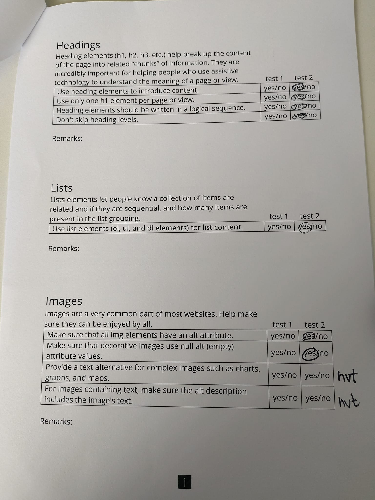

# Procesverslag

## Jij

  
uitwerken voor kick-off werkgroep

  ### Auteur:
  Lisa Luijkman

  #### Je startniveau:
  rood

  #### Je focus:
  surface plane

## Je website

  
uitwerken voor kick-off werkgroep

  ### Je opdracht:
   https://www.escadrille.org/en/home/  

  #### Screenshot(s) van de eerste pagina (small screen): 
  hier de naam van de pagina  
  

  #### Screenshot(s) van de tweede pagina (small screen):
  hier de naam van de pagina  
  
 

## Toegankelijkheidstest 1/2 (week 1)

  
uitwerken na test in 2e werkgroep

  ### Bevindingen
  Lijst met je bevindingen die in de test naar voren kwamen:

  Ik merkte dat ik het lastig vind de screenreader te gebruiken maar dat dit nog meer werd versterkt door mijn gekozen website. De website crasht soms waardoor ik dan niet verder kan en alleen een wit scherm zie. De linkjes zijn soms goed gelabeld maar als er een foto wordt gebruikt als link, bijvoorbeeld bij de socialmedia icoontjes hoor je alleen: "link". Ook hebben ze een lijst met bedrijven waarmee ze samenwerken waar je ook alleen maar een logo ziet zonder tekst. In de screenreader hoor je dan ook: "link logo" dit is dus totaal niet toegankelijk omdat je niet alleen niet weet waar je heen gaat maar ook nog op een hele andere website terecht komt. 
  Bij het doorlopen van de headings loop ik de hele tijd vast en kom ik er niet doorheen. De headings die ik kan horen zijn op zich prima maar niet altijd even logisch. 

  
  
  
  
  

Uit de wcag checklist kwamen de volgende punten:
- de links hebben nog geen goed (aria)label
- menu wilt niet open als je erdoorheen tabt
- headings zijn niet overal logisch
- alt tekst moet heel veel beter want die ontbreekt
- prefers-reduced-motion werkt helemaal niet
- contrast is bijna overal goed

## Breakdownschets (week 1)

  
uitwerken na afloop 3e werkgroep

  ### de hele pagina: 
  
  

  ### dynamisch deel (bijv menu): 
  
  

## Voortgang 1 (week 2)

  
uitwerken voor 1e voortgang

  ### Agenda voor meeting
  samen met je groepje opstellen

  | student koen      
   - html
   - navigatie
   - structuur css

  student Lisa
  -  html doornemen
  - nog even kijken naar menu
  - header welke soort foto voor het logo?

  ### Verslag van meeting
  hier na afloop snel de uitkomsten van de meeting vastleggen

  - punt 1: navigatie bar werkt niet met sticky en fixed --> de ul uit de header halen
  - punt 2: foto van logo --> mag met img maar dan lege alt of met before (doe het wel consistent)
  - punt 3: hoe maak ik de bewegende tekst? --> bewegende tekst met marquee, maar dan met display block enzo en reduces motion
 
  

## Voortgang 2 (week 3)

  
uitwerken voor 2e voortgang

  ### Agenda voor meeting
  samen met je groepje opstellen

  student koen      
   -html doornemen
   - responsive maken articles
   - carrousel 

  student Lisa
  -  html doornemen
  - nog even kijken naar menu
  - header welke soort foto voor het logo?
  - carrousel image

  ### Verslag van meeting
  hier na afloop snel de uitkomsten van de meeting vastleggen

  - punt 1: marquee margin -> negatief
  - punt 2: background image svg -> aparte file aanmaken
  - nog een punt : discover in de article -> link maken en dan met java alles klikbaar maken
  - html controleren -> alle sections moeten een h2 hebben, de ul van de nav mag tussen de header en main in, veel van mijn articles zijn geen articles (alleen dingen die los kunnen staan zijn articles)

## Toegankelijkheidstest 2/2 (week 4)

  
uitwerken na test in 9e werkgroep

  ### Bevindingen
  Lijst met je bevindingen die in de test naar voren kwamen (geef ook aan wat er verbeterd is):

  Het is al een stuk beter dan de orginele site, vooral in html -> kopjes, links, arialabels

  Ik kreeg van Teun een paar tips die ik zo veel mogelik heb verbeterd:
  - ipv pagina naam escadrille homepage -> home escadrille, dan staat de belagntijkste informatie vooraan
  - misschien nog de focus styling aanpassen
  - het menu glitcht op telefoon als je de orientatie aanpast

  
  
  
  
  

## Voortgang 3 (week 4)

  
uitwerken voor 3e voortgang

  ### Agenda voor meeting
  samen met je groepje opstellen

  student koen      
   - javascript menu kapot
  
  student Sol
  - font downloaden

  student Lisa
  -  order nieuwsartikelen
  - hoe de tweede carrousel maken?

  ### Verslag van meeting
  hier na afloop snel de uitkomsten van de meeting vastleggen

  - punt 1 -> fancy carrousel, codepen
  - punt 2 -> order, snappen student assistenten ook niet
  - punt 3 -> html checken, geen styling in svg, geen lege alt (of toch wel?) 
  - ...

## Eindgesprek (week 5)

  
uitwerken voor eindgesprek

  ### Je uitkomst - karakteristiek screenshots:
  
  

  ### Dit ging goed/Heb ik geleerd: 
  Korte omschrijving met plaatjes

  Wat hierboven bij karakteristiek staat ging al erg goed en benk ik erg trots op, mar ook het menu, het was even uitvogelen maar uiteindelijk ben ik trots op het resultaat. 
  

  ### Dit was lastig/Is niet gelukt:
  Korte omschrijving met plaatjes

  Hoewel het me is gelukt de carrousel deels te maken is het me niet gelukt een terugknop werkend te krijgen. DIt omdat ik met verschillende states werk en het te veel tijd kost dit uit te vogelen.
   

## Bronnenlijst

  
continu bijhouden terwijl je werkt

  Nb. Wees specifiek ('css-tricks' als bron is bijv. niet specifiek genoeg). 
  Nb. ChatGpT en andere AI horen er ook bij.
  Nb. Vermeld de bronnen ook in je code.

  1. bron 1, animatie scrollen : https://codepen.io/Nienke-the-styleful/pen/zYgYomN 
  2. bron 2, carrousel 1 : https://codepen.io/teun-dames/pen/MWNWJro 
  3. bron 3, menu : https://codepen.io/lisa_luijk/pen/OJeGJxE

