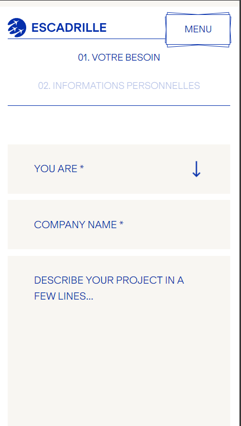
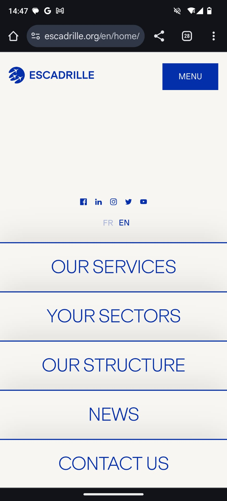

# Procesverslag
Markdown is een simpele manier om HTML te schrijven.  
Markdown cheat cheet: [Hulp bij het schrijven van Markdown](https://github.com/adam-p/markdown-here/wiki/Markdown-Cheatsheet).

Nb. De standaardstructuur en de spartaanse opmaak van de README.md zijn helemaal prima. Het gaat om de inhoud van je procesverslag. Besteedt de tijd voor pracht en praal aan je website.

Nb. Door *open* toe te voegen aan een *details* element kun je deze standaard open zetten. Fijn om dat steeds voor de relevante stuk(ken) te doen.

## Jij

  
uitwerken voor kick-off werkgroep

  ### Auteur:
  Lisa Luijkman

  #### Je startniveau:
  rood

  #### Je focus:
  surface plane

## Je website

  
uitwerken voor kick-off werkgroep

  ### Je opdracht:
   https://www.escadrille.org/en/home/  

  #### Screenshot(s) van de eerste pagina (small screen): 
  hier de naam van de pagina  
  

  #### Screenshot(s) van de tweede pagina (small screen):
  hier de naam van de pagina  
  
 

## Toegankelijkheidstest 1/2 (week 1)

  
uitwerken na test in 2e werkgroep

  ### Bevindingen
  Lijst met je bevindingen die in de test naar voren kwamen:

  Ik merkte dat ik het lastig vind de screenreader te gebruiken maar dat dit nog meer werd versterkt door mijn gekozen website. De website crasht soms waardoor ik dan niet verder kan en alleen een wit scherm zie. De linkjes zijn soms goed gelabeld maar als er een foto wordt gebruikt als link, bijvoorbeeld bij de socialmedia icoontjes hoor je alleen: "link". Ook hebben ze een lijst met bedrijven waarmee ze samenwerken waar je ook alleen maar een logo ziet zonder tekst. In de screenreader hoor je dan ook: "link logo" dit is dus totaal niet toegankelijk omdat je niet alleen niet weet waar je heen gaat maar ook nog op een hele andere website terecht komt. 
  Bij het doorlopen van de headings loop ik de hele tijd vast en kom ik er niet doorheen. De headings die ik kan horen zijn op zich prima maar niet altijd even logisch. 

  
  
  
  
  

Uit de wcag checklist kwamen de volgende punten:
- de links hebben nog geen goed (aria)label
- menu wilt niet open als je erdoorheen tabt
- headings zijn niet overal logisch
- alt tekst moet heel veel beter want die ontbreekt
- prefers-reduced-motion werkt helemaal niet
- contrast is bijna overal goed

  

## Breakdownschets (week 1)

  
uitwerken na afloop 3e werkgroep

  ### de hele pagina: 
  
  

  ### dynamisch deel (bijv menu): 
  
  

<!--   ### wellicht nog een dynamisch deel (bijv filter): 
   -->

## Voortgang 1 (week 2)

  
uitwerken voor 1e voortgang

  ### Stand van zaken
  hier dit ging goed & dit was lastig (neem ook screenshots op van delen van je website en code)

  ### Agenda voor meeting
  samen met je groepje opstellen

  | student koen      
   - html
   - navigatie
   - structuur css

  student Lisa
  -  html doornemen
  - nog even kijken naar menu
  - header welke soort foto voor het logo?

  ### Verslag van meeting
  hier na afloop snel de uitkomsten van de meeting vastleggen

  - punt 1: navigatie bar werkt niet met sticky en fixed --> de ul uit de header halen
  - punt 2: foto van logo --> mag met img maar dan lege alt of met before (doe het wel consistent)
  - punt 3: hoe maak ik de bewegende tekst? --> bewegende tekst met marquee, maar dan met display block enzo en reduces motion
 

  

## Voortgang 2 (week 3)

  
uitwerken voor 2e voortgang

  ### Stand van zaken
  hier dit ging goed & dit was lastig (neem ook screenshots op van delen van je website en code)

  ### Agenda voor meeting
  samen met je groepje opstellen

  | student 1      | student 2          | student 3    | student 4        |
  | ---            | ---                | ---          | ---              |
  | dit bespreken  | en dit             | en ik dit    | en dan ik dat    |
  | en dat ook nog | dit als er tijd is | nog een punt | dit wil ik zeker |
  | ...            | ...                | ...          | ...              |

  ### Verslag van meeting
  hier na afloop snel de uitkomsten van de meeting vastleggen

  - punt 1
  - punt 2
  - nog een punt
- ...

## Toegankelijkheidstest 2/2 (week 4)

  
uitwerken na test in 9e werkgroep

  ### Bevindingen
  Lijst met je bevindingen die in de test naar voren kwamen (geef ook aan wat er verbeterd is):

## Voortgang 3 (week 4)

  
uitwerken voor 3e voortgang

  ### Stand van zaken
  hier dit ging goed & dit was lastig (neem ook screenshots op van delen van je website en code)

  ### Agenda voor meeting
  samen met je groepje opstellen

  | student 1      | student 2          | student 3    | student 4        |
  | ---            | ---                | ---          | ---              |
  | dit bespreken  | en dit             | en ik dit    | en dan ik dat    |
  | en dat ook nog | dit als er tijd is | nog een punt | dit wil ik zeker |
  | ...            | ...                | ...          | ...              |

  ### Verslag van meeting
  hier na afloop snel de uitkomsten van de meeting vastleggen

  - punt 1
  - punt 2
  - nog een punt
  - ...

## Eindgesprek (week 5)

  
uitwerken voor eindgesprek

  ### Je uitkomst - karakteristiek screenshots:
  

  ### Dit ging goed/Heb ik geleerd: 
  Korte omschrijving met plaatjes

  

  ### Dit was lastig/Is niet gelukt:
  Korte omschrijving met plaatjes

  

## Bronnenlijst

  
continu bijhouden terwijl je werkt

  Nb. Wees specifiek ('css-tricks' als bron is bijv. niet specifiek genoeg). 
  Nb. ChatGpT en andere AI horen er ook bij.
  Nb. Vermeld de bronnen ook in je code.

  1. bron 1
  2. bron 2
  3. ...

